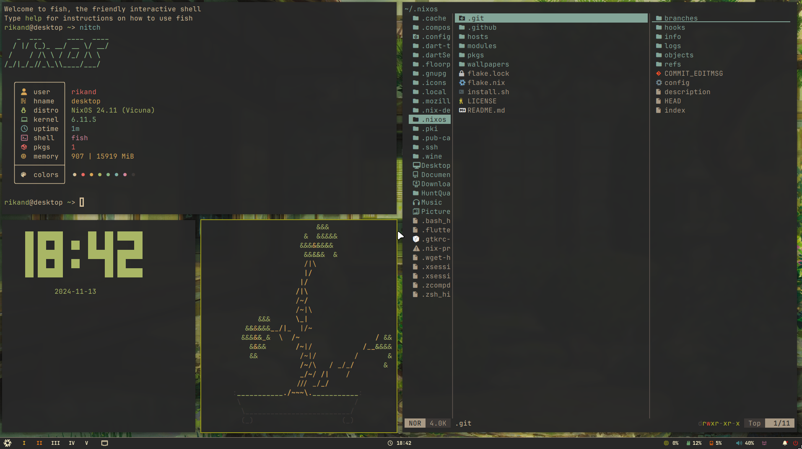
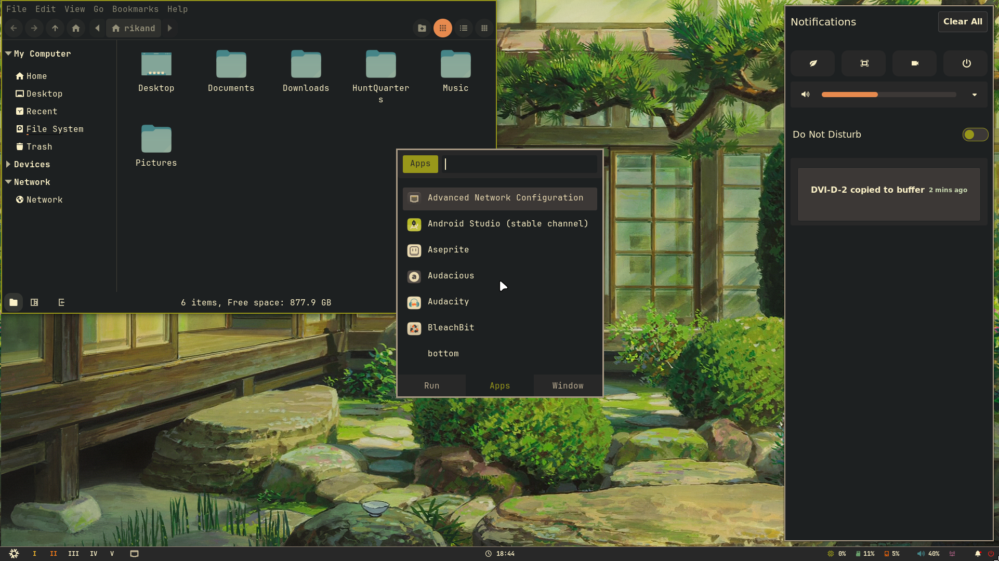
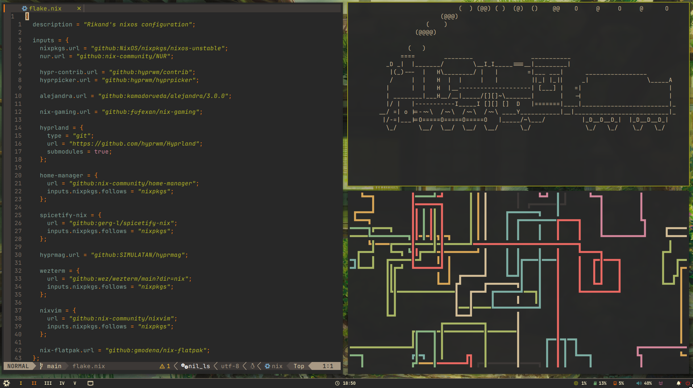
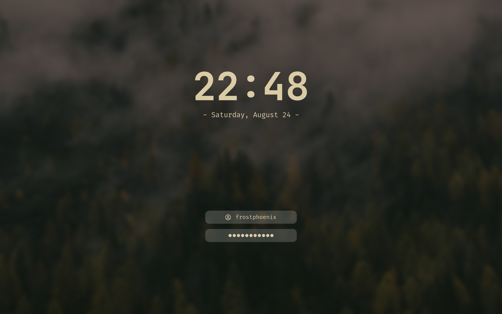

<h1 align="center">
   
   <br>
      Rikand Flakes
   <br>
       <br>

</h1>


### 🖼️ Gallery

<p align="center">
    <br>
    <br>
    <br>
   Screenshots last updated <b>2024-08-24</b>
</p>

<details>
<summary>
Hyprlock (EXPAND)
</summary>
<p align="center">
    <br>
</p>
</details>

# 🗃️ Overview

## 📚 Layout

-   [flake.nix](flake.nix) base of the configuration
-   [hosts](hosts) 🌳 per-host configurations that contain machine specific configurations
    - [desktop](hosts/desktop/) 🖥️ Desktop specific configuration
    - [laptop](hosts/laptop/) 💻 Laptop specific configuration
    - [vm](hosts/vm/) 🗄️ VM specific configuration
-   [modules](modules) 🍱 modularized NixOS configurations
    -   [core](modules/core/) ⚙️ Core NixOS configuration
    -   [homes](modules/home/) 🏠 my [Home-Manager](https://github.com/nix-community/home-manager) config
-   [pkgs](flake/pkgs) 📦 Packages Build from source
-   [wallpapers](wallpapers/) 🌄 wallpapers collection

## 📓 Components
|                             | NixOS + Hyprland                                                                              |
| --------------------------- | :---------------------------------------------------------------------------------------------:
| **Window Manager**          | [Hyprland][Hyprland] |
| **Bar**                     | [Waybar][Waybar] |
| **Application Launcher**    | [rofi][rofi] |
| **Notification Daemon**     | [swaync][swaync] |
| **Terminal Emulator**       | [Wezterm][Wezterm] |
| **Shell**                   | [fish][fish] |
| **Text Editor**             | [Neovim][Neovim] |
| **network management tool** | [NetworkManager][NetworkManager] + [network-manager-applet][network-manager-applet] |
| **System resource monitor** | [Btop][Btop] |
| **File Manager**            | [yazi][yazi] |
| **Fonts**                   | [CascadiaCode Nerd Font][Nerd fonts] + [JetBrainsMono Nerd Font][Nerd fonts] |
| **Color Scheme**            | [Gruvbox Dark Hard][Gruvbox] |
| **Cursor**                  | [Bibata-Modern-Ice][Bibata-Modern-Ice] |
| **Icons**                   | [Gruvbox-plus][Gruvbox-plus] |
| **Lockscreen**              | [Hyprlock][Hyprlock] + [Swaylock-effects][Swaylock-effects] |
| **Image Viewer**            | [qview][qview] |
| **Media Player**            | [mpv][mpv] |
| **Music Player**            | [audacious][audacious] |
| **Screenshot Software**     | [grimblast][grimblast] |
| **Screen Recording**        | [wf-recorder][wf-recorder] |
| **Clipboard**               | [wl-clip-persist][wl-clip-persist] |
| **Color Picker**            | [hyprpicker][hyprpicker] |


</details>

# 🚀 Installation

> [!CAUTION]
> Applying custom configurations, especially those related to your operating system, can have unexpected consequences and may interfere with your system's normal behavior. While I have tested these configurations on my own setup, there is no guarantee that they will work flawlessly for you.
> **I am not responsible for any issues that may arise from using this configuration.**

> [!NOTE]
> It is highly recommended to review the configuration contents and make necessary modifications to customize it to your needs before attempting the installation.

#### 1. **Install NixOs**

First install nixos using any [graphical ISO image](https://nixos.org/download.html#nixos-iso).
> [!NOTE]
> Only been tested using the Gnome graphical installer and choosing the ```No desktop``` option durring instalation.

#### 2. **Clone the repo**

```bash
nix-shell -p git
git clone https://github.com/Rikardp98/.nixos
cd nixos-config
```
#### 3. **Install script**
> [!CAUTION]
> For some computers, the default rebuild command might get stuck due to CPU cores running out of RAM. To fix that modify the install script line: ```sudo nixos-rebuild switch --flake .#${HOST}``` to ```sudo nixos-rebuild switch --cores <less than your max number of cores> --flake .#${HOST}```

> [!TIP]
> As it is better to know what a script does before running it, you are advised to read it or at least see the [Install script walkthrough](#Install-script-walkthrough) section before execution.

Execute and follow the installation script :
```bash
./install.sh
```

#### 4. **Reboot**

After rebooting, the config should be applied, you'll be greeted by hyprlock prompting for your password.

#### 5. **Manual config**

Even though I use home manager, there is still a little bit of manual configuration to do:
- Set Aseprite theme (they are in the folder `./.nixos/modules/home/aseprite/themes`).
- Enable Discord theme (in Discord settings under VENCORD > Themes).
- Configure the browser (for now, all browser configuration is done manually).
- Change the git account information in `./modules/home/git.nix`
```nix
programs.git = {
   ...
   userName = "Rikand";
   userEmail = "test@gmail.com";
   ...
};
```

## Install script walkthrough

A brief walkthrough of what the install script does.

#### 1. **Get username**

You will receive a prompt to enter your username, with a confirmation check.

#### 2. **Set username**

The script will replace all occurancies of the default usename ```CURRENT_USERNAME``` by the given one stored in ```$username```

#### 3. Create basic directories

The following directories will be created:
- ```~/Music```
- ```~/Documents```
- ```~/Pictures/wallpapers/others```

#### 4. Copy the wallpapers

Then the wallpapers will be copied into ```~/Pictures/wallpapers/others``` which is the folder in which the ```wallpaper-picker.sh``` script will be looking for them.

#### 5. Get the hardware configuration

It will also automatically copy the hardware configuration from ```/etc/nixos/hardware-configuration.nix``` to ```./hosts/${host}/hardware-configuration.nix``` so that the hardware configuration used is yours and not the default one.

#### 6. Choose a host (desktop / laptop)

Now you will need to choose the host you want. It depend on whether you are using a desktop or laptop (or a VM altho it can be realy buggy).

#### 7. Build the system

Lastly, it will build the system, which includes both the flake config and home-manager config.

# 👥 Credits

Other dotfiles that I learned / copy from:

- Nix Flakes
  - [Frost-Phoenix/nixos-config](https://github.com/Frost-Phoenix/nixos-config) Heavily based on this config!


<!-- # ✨ Stars History -->

<!-- <p align="center"></p> -->

<p align="center"></p>

<!-- end of page, send back to the top -->

<div align="right">
  <a href="#readme">Back to the Top</a>
</div>

<!-- Links -->
[Hyprland]: https://github.com/hyprwm/Hyprland
[Wezterm]: https://wezfurlong.org/wezterm/index.html
[Starship]: https://github.com/starship/starship
[Waybar]: https://github.com/Alexays/Waybar
[rofi]: https://github.com/lbonn/rofi
[Btop]: https://github.com/aristocratos/btop
[nemo]: https://github.com/linuxmint/nemo/
[yazi]: https://github.com/sxyazi/yazi
[fish]: https://fishshell.com/
[Swaylock-effects]: https://github.com/mortie/swaylock-effects
[Hyprlock]: https://github.com/hyprwm/hyprlock
[audacious]: https://audacious-media-player.org/
[mpv]: https://github.com/mpv-player/mpv
[Neovim]: https://github.com/neovim/neovim
[grimblast]: https://github.com/hyprwm/contrib
[qview]: https://interversehq.com/qview/
[swaync]: https://github.com/ErikReider/SwayNotificationCenter
[Nerd fonts]: https://github.com/ryanoasis/nerd-fonts
[NetworkManager]: https://wiki.gnome.org/Projects/NetworkManager
[network-manager-applet]: https://gitlab.gnome.org/GNOME/network-manager-applet/
[wl-clip-persist]: https://github.com/Linus789/wl-clip-persist
[wf-recorder]: https://github.com/ammen99/wf-recorder
[hyprpicker]: https://github.com/hyprwm/hyprpicker
[Gruvbox]: https://github.com/morhetz/gruvbox
[Gruvbox-Plus]: https://github.com/SylEleuth/gruvbox-plus-icon-pack
[Bibata-Modern-Ice]: https://www.gnome-look.org/p/1197198
[maxfetch]: https://github.com/jobcmax/maxfetch
